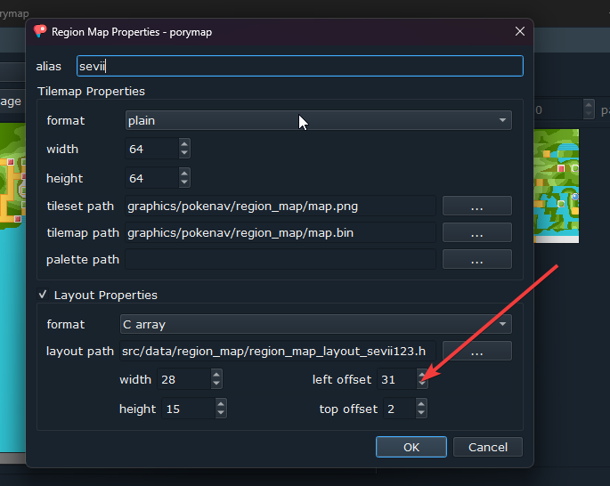
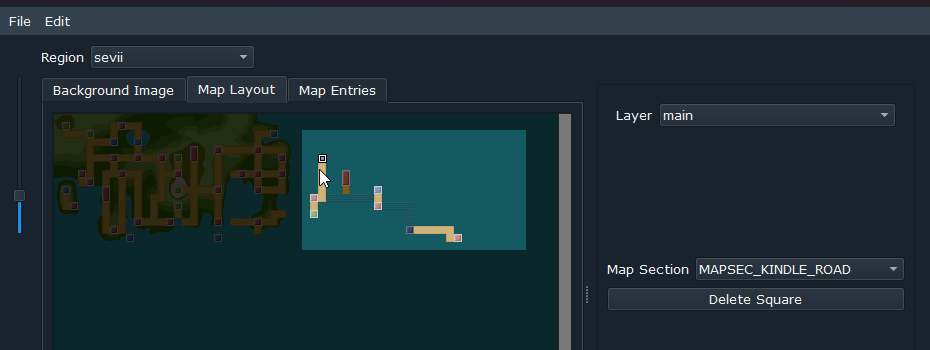

Map scrolling branch
# HAS DEPENDENCY ON COMFY ANIMS BY HUDERLEM https://github.com/huderlem/pokeemerald/tree/comfy_anims

Adds support for horizontal and vertical scrolling of region map up to 4 pages in 2x2 grid layout.

How to use:

1) grab this commit by doing the following (I don't recommend pulling since there's a lot of unnecessary stuff in my project):
    > git remote add rahtak https://github.com/Eemeliri/soulgold
    
    > git fetch rahtak map-scrolling
    
    > git cherry-pick (region map commit)
    
2) find ``static const mapsec_u16_t (*const sRegionMapPageLayouts[REGION_MAP_PAGE_MAX])[MAP_WIDTH] =`` in region_map.c and change the " [REGION_MAP_PAGE_SECOND] = sRegionMapSections_Sevii123," to your second, third and fourth region layout, leave them as NULL if you want to have less than four. (This prevents scrolling to those pages)
3) Note: you need to change all mentions of ``mapsec_u16`` into ``mapsec_u8`` if you have not expanded map sections to u16. 
3) Do the following edits to porymap region map settings:
    - Add region maps with following settings:
    Porymap offsets for each page:
    Region 1: Left 1, Top 2
    Region 2: Left 31, Top 2
    Region 3: Left 1, Top 22
    Region 4: Left 31, Top 22 
    
    

Credits:
- [Huderlem: Comfy Anims](https://github.com/huderlem/pokeemerald/tree/comfy_anims)
- [MatheoVignaud: The idea for how it was done in old Pokeemerald](https://github.com/MatheoVignaud/pokeemerald/tree/scrolling-worldmap)
